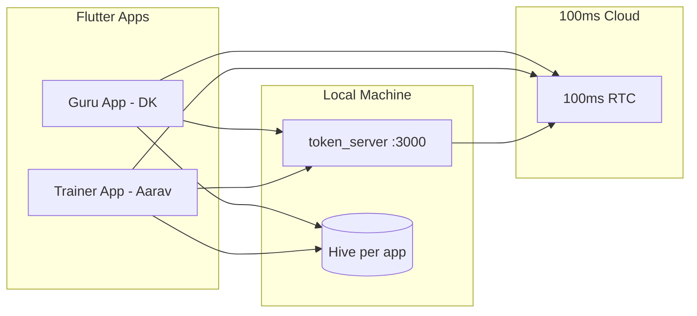

# Architecture

## Overview

## Layers (per app)

| Layer | Responsibility |
|-------|----------------|
| **UI** (`guru_app/lib`, `trainer_app/lib`, `shared/lib/screens`) | Screens, navigation, animations |
| **State** (Riverpod `app_providers.dart`) | DI for services |
| **Services** (`shared/lib/services`) | Auth, Chat, Call, Sync abstractions |
| **Models** (`shared/lib/models`) | User, Message, CallRequest, SessionLog, RoomMeta |
| **Utils** | Theme, logging, validation, API config |

## Cross-app sync

Android/iOS sandboxes prevent two apps from sharing Hive files. A **local Node server** (`token_server`) holds the shared source of truth:

- REST for CRUD (messages, requests, sessions)
- Polling from Flutter (~800ms) for near real-time UX
- JSON persistence in `token_server/data/store.json`

## Chat flow

1. Sender `POST /api/messages`
2. Server broadcasts via WebSocket (optional) + pollers fetch updates
3. Receiver marks read via `POST /api/messages/read` when conversation is open
4. Typing indicator simulated client-side (400–800ms) per assessment

## Scheduling & rooms

1. Member creates `CallRequest` (pending)
2. Trainer approves → server creates `RoomMeta` + system chat message
3. Decline → reason stored + system message to member

## 100ms RTC

1. **Token**: `GET /token?userId=&role=&roomId=`
   - Dev: `HMS_DEV_MODE=true` issues mock JWT for UI testing
   - Prod: management token → room auth token via 100ms API
2. **Join**: `CallService` builds `HMSSDK`, `HMSConfig(authToken, userName)`
3. **Reconnect**: `onReconnecting` / `onReconnected` on `HMSUpdateListener`
4. **End**: `leave()` → `SessionLog` POST with duration

## Observability

- Structured logs: `[AUTH]`, `[CHAT]`, `[RTC]`, `[SCHEDULE]`
- DevPanel FAB: API base URL, build info, last 20 log lines

## Security

- No secrets in repo; `.env.example` only
- Keys masked in DevPanel
- Cleartext HTTP allowed for localhost dev only (`usesCleartextTraffic`)
